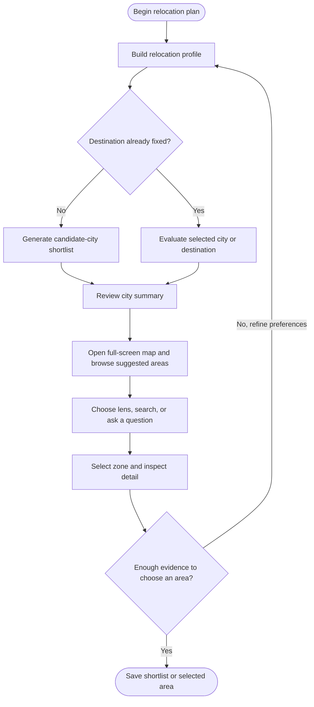

# Jejak
## Personalized Relocation and Local-Area Decision Platform

## Project Overview

Jejak helps people decide where to move within Indonesia for education, employment, or both.

Users describe their background, plans, budget, housing needs, commute tolerance, and personal priorities. The platform then recommends suitable cities and lets users explore specific districts, neighborhoods, or data-supported zones inside each city.

It answers:

> **Which city and local area best fit the life I am planning?**

The platform does not stop at a city recommendation. A city-level summary provides context, while a full-screen map workspace reveals more detailed areas through selectable zones, a focused thematic visualization, and supporting map evidence. Users can inspect where relevant jobs are concentrated, what housing may cost nearby, how long commuting could take, and which education or public-service facilities are accessible.

Jejak combines structured relocation profiles, geographic data, transparent scoring, and AI-assisted explanation. It helps users compare realistic trade-offs rather than declaring one location universally best.

---

## Tech Stack

| Layer | Choice |
|---|---|
| Full-stack framework | Next.js App Router + TypeScript |
| Styling | Tailwind CSS + daisyUI |
| Mapping | MapLibre GL JS |
| React map integration | `react-map-gl/maplibre` |
| Advanced overlays | deck.gl only if native MapLibre layers become insufficient |
| Main database | Supabase PostgreSQL |
| Geographic database | PostGIS |
| Authentication | Supabase Auth |
| File storage | Supabase Storage |
| AI orchestration | Langflow |
| Data preparation | Python + Polars/Pandas + GeoPandas |
| Deployment | Vercel |
| Large map files | Supabase Storage or static PMTiles |

---

## Macro Problem

Where someone lives in Indonesia significantly affects access to:

- suitable employment and wages
- relevant universities or training
- affordable housing
- manageable commuting
- internet connectivity
- healthcare and public services
- daily living affordability

People considering relocation usually research these factors separately across job portals, property platforms, maps, university websites, government statistics, and social media. The information often uses different geographic levels and time periods, making comparisons slow and inconsistent.

Someone planning an IT education and career may find that:

```text
City A
More technology jobs
Higher wages
Expensive housing near employment centers
Longer commute from affordable areas

City B
Fewer technology jobs
Lower average wages
More affordable housing
Relevant universities and shorter local trips
```

City averages also hide important local differences. A city may appear affordable overall while the neighborhoods near campuses or employment centers are expensive. It may have many jobs, but those jobs may be concentrated far from suitable housing.

The deeper problem is:

> **Relocation decisions require city-level context and local-area detail, but the evidence is fragmented and difficult to compare against a person's circumstances.**

---

## Target Users

Primary users:

- university applicants and students
- fresh graduates
- job seekers
- young workers
- people moving for education or employment

Secondary users:

- university career centers
- recruitment and relocation platforms
- employers supporting employee relocation
- housing platforms
- regional governments

The initial product should focus on individuals making a real relocation decision. Institutional analysis can become a later expansion.

---

## Core Solution

Jejak provides a guided relocation journey:

1. The user completes a structured profile.
2. The platform applies hard constraints such as budget, study requirements, and geographic limits.
3. A transparent decision engine ranks suitable candidate cities.
4. The user opens a city summary to understand its overall fit.
5. The full-screen map zooms into selectable local zones within that city. Floating controls provide category lenses, search, and map actions.
6. The user explores suggested areas in a bottom sheet, selects a zone, and reads detailed intelligence in a right sidebar on desktop or a zone-detail sheet on mobile.
7. The user changes the category lens or asks a question. The map shows one primary visualization for the current task while the system explains matches and compromises.
8. The user changes an assumption and the recommendations update.

Example request:

> I want to study Information Technology and begin an IT career. My monthly budget is Rp4 million, I prefer a kos, and I want a commute below 45 minutes.

The platform may shortlist Bandung, Jakarta, Yogyakarta, Surabaya, or other cities supported by the available evidence. Opening Bandung would then reveal suitable areas within the city rather than treating all of Bandung as one result.

---

## User Flow



### Flow stages

| Stage | User action | System response |
|---|---|---|
| Start | Chooses whether they are moving for study, work, or both | Opens the relevant onboarding path |
| Profile | Enters field, budget, housing, transport, commute, and location preferences | Builds a structured relocation profile and confirms inferred priorities |
| Destination choice | States whether a city, campus, office, or other destination is already fixed | Selects national discovery or destination-based search |
| City discovery | Reviews candidate cities or opens the selected city | Shows personal fit, evidence coverage, main advantages, and trade-offs |
| Local exploration | Browses the bottom sheet, searches, changes a category lens, or asks a question | Updates suggested areas and shows one primary map visualization with an optional supporting overlay |
| Evaluation | Selects and compares promising areas | Opens detailed zone intelligence in the desktop right sidebar or the mobile zone-detail sheet; shows fit, cost, commute, nearby destinations, and evidence quality |
| Refinement | Changes a constraint or priority | Recalculates candidates and clearly explains what changed |
| Decision | Saves one or more areas | Creates a shortlist that can be revisited and compared |

---

## Feature Inventory

### Core MVP features

| Product area | Feature | What it does |
|---|---|---|
| Onboarding | Relocation-goal selector | Separates study, employment, and combined journeys |
| Onboarding | Guided relocation questionnaire | Collects field, career stage, budget, housing, transport, commute, and location preferences |
| Onboarding | Hard-constraint confirmation | Confirms limits such as maximum rent, required study program, and maximum commute |
| Onboarding | Priority controls | Lets users adjust the importance of career, education, affordability, mobility, and optional lifestyle factors |
| Discovery | Personalized city shortlist | Returns supported cities that satisfy hard constraints, ordered by personal fit |
| Discovery | City summary | Shows overall fit, career and education access, wage context, cost range, mobility conditions, data coverage, and trade-offs |
| Discovery | City comparison | Compares shortlisted cities using the same profile, indicators, and time basis |
| Map | Full-screen workspace and floating controls | Keeps the map as the main canvas without a traditional header; groups category, search, and map controls over it |
| Map | Category lenses | Uses Ringkasan as the default lens; career, education, housing, cost, commute, and connectivity buttons set a default context for browsing and follow-up questions |
| Map | Primary visualization | Shows one defined metric as the category choropleth or another single primary map view, with an optional supporting overlay |
| Map | Zone explorer | Lets users select districts, neighborhoods, grid cells, or other supported local areas, including zones without enrichment when trusted geometry exists |
| Map | Query-result view | Temporarily replaces the lens visualization for complex or multi-category questions and highlights the resulting areas without blending thematic layers |
| Map | Bottom-sheet discovery | Offers suggested areas and search with collapsed, center, and expanded snap states; keeps card widths and gaps stable across states |
| Map | Interactive bubbles | Opens universities, employment clusters, transit hubs, housing clusters, and other point-based evidence |
| Map | Commute bands | Shows areas within distance categories or estimated travel-time ranges of a selected destination |
| Map | Zone detail panel | Shows local fit, housing range, monthly-cost estimate, commute, nearby destinations, data resolution, and evidence freshness in a desktop right sidebar or mobile zone-detail sheet |
| Decision | Zone comparison | Compares two or more local areas without losing the city-level context |
| Decision | Shortlist | Saves candidate cities and zones for later review |
| Decision | Counterfactual controls | Recalculates results when the user changes budget, salary priority, commute, remote-work status, or destination |
| AI | Preference interpretation | Converts natural-language answers into structured preferences for user confirmation |
| AI | Grounded recommendation explanation | Explains recommendations from retrieved metrics and score components without inventing statistics |
| AI | Conversational refinement and query scopes | Applies requests such as “prioritize salary” or “stay within 30 minutes of this campus”; explicit prompts outrank the active lens and may create several category query scopes |
| AI | Scoped evidence enrichment | Starts LF-01 only when the user requests a specific evidence scope with missing or stale accepted evidence |
| Trust | Evidence disclosure | Shows source, year, geographic level, observation type, and limitations for material claims |

### Expansion features

| Feature | Purpose |
|---|---|
| Multiple saved profiles | Compare scenarios such as living alone, moving with family, or working remotely |
| Total relocation budget | Estimate deposits, moving costs, initial rent, and recurring monthly expenses |
| Live housing and vacancy partnerships | Replace sampled observations with fresher listings and openings |
| Route-aware daily planning | Compare several regular destinations instead of one campus or workplace |
| Shareable relocation brief | Export or share a shortlist with family, counselors, or employers |
| Relocation checklist | Turn a selected area into a practical moving plan |

---

## Relocation Profile

The onboarding questionnaire should collect only information that materially changes the recommendation.

### Essential inputs

| Category | Example input |
|---|---|
| Relocation goal | Study, work, or both |
| Intended field | Information Technology |
| Education level | Undergraduate |
| Career stage | Student or fresh graduate |
| Monthly budget | Rp4,000,000 |
| Housing preference | Kos or apartment |
| Maximum housing cost | Rp1,800,000 |
| Transport mode | Public transport or motorcycle |
| Commute tolerance | Maximum 45 minutes |
| Geographic limits | Anywhere, selected islands, or selected cities |
| City preference | Metropolitan, medium city, or quieter area |
| Priorities | Career access, education, affordability, and commute |

The platform separates:

- **Hard constraints:** conditions that should not be violated, such as maximum rent or required study program.
- **Soft preferences:** factors that affect ranking but can be traded off, such as urban density or nightlife.

Example structured profile:

```json
{
  "goal": ["study", "career"],
  "field": "information_technology",
  "monthly_budget": 4000000,
  "housing_types": ["kos", "apartment"],
  "maximum_rent": 1800000,
  "maximum_commute_minutes": 45,
  "allowed_regions": [],
  "preferred_city_type": "medium_or_metropolitan",
  "priorities": {
    "career_opportunity": 0.35,
    "education_access": 0.25,
    "affordability": 0.25,
    "mobility": 0.15
  }
}
```

Langflow can interpret conversational answers and propose structured priorities, but the user should confirm inferred constraints and weights before the system ranks locations.

The prototype should avoid collecting unnecessary identity or sensitive information such as national ID numbers, religion, ethnicity, exact home address, or detailed health information.

---

## Recommendation Model

Jejak should not publish a universal ranking of Indonesian cities.

The system first applies hard constraints. It then calculates a personal fit score using normalized, documented indicators:

```text
Relocation Fit =
  career weight × career fit
+ education weight × education fit
+ affordability weight × affordability fit
+ mobility weight × mobility fit
+ optional lifestyle weight × lifestyle fit
```

The scoring engine must remain deterministic. AI can interpret user priorities and explain results, but it must not invent scores, statistics, or ranking changes.

The user-facing result should emphasize:

- why an area matches
- which requirements it satisfies
- its main strengths
- its most important compromises
- data sources and dates
- missing or low-confidence evidence

The numeric fit score can support sorting, but it should not imply that a complex relocation decision is objectively solved.

---

## Geographic Experience

Jejak uses two connected levels of detail.

### 1. City summary

Every recommended city receives a concise summary containing:

- overall fit for the current user
- relevant education and career availability
- city-level wage benchmark
- general housing and living-cost range
- typical mobility conditions
- strongest advantages
- major trade-offs
- data coverage and recency

The city summary helps the user decide which destinations deserve deeper exploration.

### 2. Local-area exploration

Opening a city zooms the map into districts, neighborhoods, grid cells, or other zones supported by the available data.

### Map workspace and panels

The map fills the screen without a traditional header. Small groups of floating controls provide category lenses, search, location and zoom actions. Ringkasan opens by default and keeps the map mostly neutral; selected and recommended areas receive emphasis. Category buttons set the default context for exploration. They do not lock the user into a mode.

The bottom sheet supports discovery, suggested areas, and search. The right sidebar holds detailed intelligence for a selected zone. Desktop can show both at once so a user can keep exploring while reading zone details. Mobile uses one bottom-sheet surface and switches its content between exploration and zone-detail views.

The bottom sheet has collapsed, center, and expanded snap states. In the center state, suggested-area cards form one horizontally scrolling row. Each card uses the same width and `gap-3` spacing as a five-column expanded grid: `auto-cols-[calc((100%_-_3rem)/5)]` in the center state and `grid-cols-5` in the expanded state. The expanded state scrolls vertically. Both layouts use the same content width and padding, so the cards keep their horizontal positions as the sheet changes height.

### Visualization rules

A category lens displays one choropleth or other primary metric at a time, with one optional supporting overlay such as relevant points or bubbles. Each thematic scale needs a clear metric, legend, geography, source, and date. A question that spans categories creates separate query scopes for retrieval and evaluation. The map then shows one query-result visualization at a time, such as qualifying zones, while supporting evidence stays in the panel. The interface does not blend several category choropleths into one map.

Map visualization and data availability are separate decisions. An enrichment result can improve a zone's detail panel without changing the current map. The map changes only when the user changes the lens, submits a prompt that calls for a result view, or chooses another visualization.

Possible interactive layers include:

| Map element | Example use |
|---|---|
| Filled zones | Relative affordability or local fit by area |
| Heatmap | Concentration of IT workers, vacancies, campuses, or housing listings |
| Bubbles | Universities, technology clusters, transit hubs, or rental concentrations |
| Commute bands | Areas under 5 km, 5–10 km, or beyond 10 km from a selected destination |
| Travel-time areas | Estimated reachable area within 15, 30, or 45 minutes |
| Housing points or clusters | Kos and apartment observations with price ranges |

Users can press a zone or bubble to open a local detail panel showing:

- local fit for their profile
- relevant nearby opportunities
- housing-cost estimate
- estimated total monthly cost
- distance or commute to selected campuses and employment centers
- transport availability
- evidence quality and geographic resolution
- fresh, stale, or missing enrichment status for the requested evidence scope

The platform may infer a local-area recommendation from several layers, but it must distinguish observed local data from city-level estimates.

For example:

> The kos estimate represents Coblong listing observations, while the IT wage benchmark represents Bandung City overall.

This prevents a city average from appearing to be a neighborhood-specific fact.

---

## Exploration Modes

### Category lenses and explicit questions

Ringkasan is the default lens. Other category buttons give the user a starting context for map browsing and suggested questions. A typed or spoken request takes precedence over that lens. For example, an education lens remains selected if the user asks about rent, but the answer uses a housing query scope and a relevant result view. A question about affordable housing near IT jobs creates housing and career scopes. The map presents the combined qualifying areas as one primary result view; the detail panel explains each scope separately. Returning to ordinary browsing restores the selected lens view.

### Explore Indonesia

The user has no fixed destination. Jejak searches across supported cities and produces a shortlist.

Example:

> Find places where I can study IT and begin an IT career on a Rp4 million monthly budget.

### Explore a selected city

The user already has a city in mind. Jejak evaluates specific areas within it.

Example:

> I want to move to Bandung. Show areas with kos below Rp1.8 million and a commute under 45 minutes to IT campuses or employment centers.

### Evaluate a fixed destination

The user specifies a university, office, or other destination. Jejak prioritizes housing and daily accessibility around that point.

Example:

> I will study at this campus. Which nearby areas fit my budget and transport preferences?

---

## Map UX and State Guidance

The interface manages these states independently:

| State | What it records | What changes it |
|---|---|---|
| Selected lens | Ringkasan or a category used as the default browsing context | A category button |
| Map visualization | Neutral Ringkasan, one category metric, or a temporary query-result view, plus at most one supporting overlay | A lens change, explicit query, or direct visualization choice |
| Selection | The zone or map feature the user has chosen | A map, card, or search-result selection |
| Query scopes | The categories, places, and evidence types needed to answer the current prompt | An explicit prompt or cleared query |
| Detail panel | Whether the selected-zone intelligence is open and which view it shows | Opening or closing a zone detail; mobile switches the shared sheet view |

A selection can change without replacing the current metric. New evidence can arrive without opening a panel or recoloring the map. A multi-category prompt can change query scopes and temporarily show qualifying zones while the selected lens remains the user's browsing default.

The bottom sheet snaps between collapsed, center, and expanded heights. The center state keeps suggested-area cards in one horizontal row; the expanded state uses a vertically scrolling five-column grid. Both use the same available width, card width, and `gap-3` spacing so cards keep their horizontal positions during the transition. Desktop can keep this sheet open beside the selected-zone right sidebar. On mobile, the one sheet switches between exploration and zone-detail content while preserving the map behind it.

---

## Counterfactual Exploration

Jejak allows users to explore how recommendations change when their circumstances change.

Example:

```text
Initial profile
IT student
Rp4 million monthly budget
Kos preferred
45-minute commute limit
```

The user then changes one assumption:

> What if I prioritize salary over affordability?

The candidate order and local-area fit update.

Then:

> What if I can work remotely?

The system reduces the importance of nearby employment concentration and may favor more affordable zones with strong connectivity.

Then:

> What if my maximum rent increases to Rp2.5 million?

Additional neighborhoods may become eligible.

The platform should show which input changed, which score components moved, and why the result changed.

---

## Role of Langflow and AI

Langflow is the runtime orchestration layer for the AI-assisted parts of Jejak.

It should coordinate four focused workflows:

### `build_relocation_profile`

Converts onboarding answers and natural-language preferences into a structured profile. It identifies missing information and asks the user to confirm inferred constraints or priorities.

### `find_matching_locations`

Passes the confirmed profile to deterministic search and scoring tools. It receives ranked cities and eligible local zones, then prepares a grounded explanation.

### `explain_location_match`

Explains why a city or local zone fits the user. It references the actual score components, source data, geographic level, and important trade-offs.

### `refine_relocation_results`

Interprets requests such as “prioritize salary” or “keep me within 30 minutes of this campus,” updates the structured profile, and triggers recalculation.

### Query scope and enrichment routing

The application keeps the selected lens as a browsing default. Langflow interprets an explicit prompt into one or more category query scopes, including the requested place, topic, and evidence type. The prompt's scopes take precedence over the lens for that response. Deterministic services fetch accepted data and calculate results for each scope. The application chooses one primary map visualization for the response and puts the scope-by-scope explanation in the detail surface.

Opening a zone does not, by itself, call LF-01. Zone selection can show trusted geometry, search results, and any accepted cached evidence. LF-01 runs only when the user requests a specific evidence scope and accepted evidence for that zone and scope is missing or stale. A background run can update the requested evidence after validation; it does not activate a map layer or change the visualization on its own.

Recommended analytical tools include:

```text
search_candidate_cities
search_candidate_zones
get_city_summary
get_zone_profile
get_career_metrics
get_education_options
get_housing_metrics
get_cost_estimate
get_commute_estimate
calculate_relocation_fit
compare_location_options
get_data_provenance
get_evidence_status
request_zone_evidence_enrichment
```

These tools should return structured data. The application gates `request_zone_evidence_enrichment` on a user-requested scope and missing or stale accepted evidence. The language model explains the evidence and manages conversational refinement.

The AI should never receive unrestricted database-write access or generate its own SQL against production data. It should use narrowly defined, testable tools.

---

## AI Output Contract

Langflow should return structured output that Next.js can validate before changing the interface.

Example:

```json
{
  "summary": "Bandung is the strongest overall city match under your current priorities.",
  "city_recommendations": [
    {
      "city_id": "BANDUNG_CITY",
      "fit_score": 84,
      "main_advantage": "Strong IT education access with lower housing costs than Jakarta",
      "main_tradeoff": "Lower city-level IT wage benchmark than Jakarta",
      "recommended_zone_ids": ["COBLONG", "SUKAJADI"]
    }
  ],
  "zone_results": [
    {
      "zone_id": "COBLONG",
      "housing_range": [1200000, 2200000],
      "estimated_commute_minutes": 28,
      "nearby_opportunity_types": ["university", "technology_employment"],
      "evidence_level": "mixed_local_and_city"
    }
  ],
  "map_actions": {
    "zoom_to_city": "BANDUNG_CITY",
    "highlight_zone_ids": ["COBLONG", "SUKAJADI"],
    "query_scopes": [
      { "category": "career", "evidence": "it_opportunity" },
      { "category": "housing", "evidence": "observed_rent" }
    ],
    "primary_visualization": "query_result_zones",
    "supporting_overlay": "universities"
  },
  "sources": [
    {
      "dataset_id": "employment_2025",
      "geographic_level": "city",
      "year": 2025
    },
    {
      "dataset_id": "housing_sample_2026_08",
      "geographic_level": "zone",
      "year": 2026
    }
  ],
  "limitations": [
    "The wage estimate covers Bandung City and does not represent a Coblong-specific wage."
  ]
}
```

After validation, the application can update recommendation cards, zoom the map, and highlight zones. The runtime owns lens, query-scope, selection, and panel state separately, so a response does not change the chosen lens or open a detail panel unless the user action calls for it. The application may temporarily display a query-result visualization while keeping the user's lens available for return.

---

## Data Foundation

BPS can provide the primary official statistical foundation, supplemented by other defensible sources where greater local detail is required.

### Labor market

- employment by industry or occupation
- unemployment
- worker education level
- wage benchmarks
- job-vacancy observations when available
- employment-center locations or clusters

### Education

- universities and campuses
- relevant programs
- education level
- tuition or admission information when available
- training and vocational centers

### Housing and affordability

- kos and apartment observations
- rent ranges
- household expenditure
- food and utility estimates
- listing date and sample size

### Mobility

- road and public-transport networks
- travel-time estimates
- distance to selected destinations
- commute-distance categories
- transit stops and stations

### Supporting factors

- internet access
- healthcare access
- safety indicators
- population density
- flood or disaster exposure
- other factors supported by reliable data

Base data collection and cleaning should happen through an ETL process before a user request. Recommendations query prepared, accepted datasets. A user request for a specific missing or stale evidence scope may start a bounded background LF-01 enrichment run under approved source and validation policies; the map remains usable while it runs.

---

## Geographic Data Rules

Each observation must record:

- source
- collection or publication date
- geographic level
- spatial coverage
- sample size when relevant
- whether the value is observed, estimated, or derived
- known limitations

The application should maintain three evidence levels:

| Level | Meaning |
|---|---|
| City-level | Value applies to the city or regency as a whole |
| Zone-level | Value was measured or aggregated for the displayed zone |
| Point-level | Value belongs to a specific campus, listing, employer, or facility |

The platform must not copy a city-level average into every neighborhood and present it as local evidence. When local data is unavailable, the interface should show the city estimate separately and mark the local value as unavailable.

Heatmaps also require clear definitions. A housing heatmap may represent listing concentration, median observed rent, or affordability, but these are different measures and must not be visually conflated.

### Searchable geography and enrichment status

Trusted zone geometry and enriched evidence have separate lifecycles. A region with a supported boundary remains searchable and selectable even if Jejak has no enriched career, housing, or other evidence for it. Search can locate and focus that region without creating a thematic value. On a category choropleth, a zone without a supported value remains outside the metric scale; it must not receive gray as though gray were a low or zero value. The neutral base map may still show its boundary, and the legend or accessible result list must identify unavailable data.

The interface tracks evidence status per zone and requested scope:

| Status | Meaning | Interface behavior |
|---|---|---|
| Fresh | An accepted snapshot meets the scope's coverage and freshness policy | Show the value with source, date, and geographic level |
| Stale | An accepted snapshot exists but exceeds its freshness policy | Show its age and limitation; keep it visible while a requested refresh runs |
| Missing | No accepted snapshot supports that scope | Show an unavailable state without inventing a metric or hiding the searchable zone |

Selecting a zone alone does not request new evidence. When a user asks for a specific evidence scope, the runtime checks its status and may start one idempotent LF-01 enrichment run for missing or stale evidence. It continues serving any accepted snapshot while that run proceeds. Enrichment only changes available evidence after validation; the current map visualization changes through a separate user or query action.

### Evidence geographic scoping

Company and job evidence is tagged by how it relates to the requested zone, not hard-filtered to it. Enrichment sources, job aggregators especially, return claims from the zone, neighbouring districts, the wider city, and beyond. Discarding everything outside the exact zone usually leaves too little to show, so the platform keeps nearby evidence, labels its locality, and lets the map aggregate and widen when the zone itself is sparse.

After geocoding, each claim receives a locality tier relative to the target zone:

| Tier | Meaning |
| --- | --- |
| `zone` | Point falls inside the zone boundary, for example Pancoran. |
| `city` | Inside the same city or regency, for example Jakarta Selatan, but outside the zone. |
| `region` | Inside the wider province or metro area but outside the city. |
| `national` | Elsewhere in Indonesia. |
| `global` | Outside Indonesia. Excluded, because a foreign location does not inform a local relocation choice. |

Rules:

- Drop `global`. A foreign headquarters says nothing about the zone.
- Prefer `zone` and point-level claims, then fall back to `city` and `region` for coverage.
- Report coverage per tier so the user sees how much evidence is exactly in the zone versus nearby.

Coverage and the map: each claim is binned to the administrative unit that contains its geocoded point, a kecamatan, or a kelurahan where those boundaries exist. That binning fixes each claim's location and its per-unit count.

Bubbles are then formed by clustering adjacent units adaptively, by proximity, density, and map zoom, so a bubble can cover a single unit or several neighbouring ones:

- A unit dense enough on its own, such as Setiabudi, stands as its own bubble.
- A sparse or empty target like Pancoran merges into an adjacent cluster, for example the Setiabudi area, instead of showing a lonely dot.
- Units with no evidence and no evidenced neighbour, such as Mampang or Pejaten, stay empty. Nothing is pulled in to fill them.
- Zooming in splits a merged bubble back into its constituent units. Zooming out merges more.

So South Jakarta reads as a few meaningful concentrations rather than one blurred blob or a scatter of lonely dots. Each bubble keeps its per-unit breakdown for the caption, for example "Setiabudi 2, Pancoran 1."

Locality tiers describe relevance distance from the searched zone. They drive ranking and the coverage message. The map geometry comes from per-unit binning plus adaptive clustering. This is honest about sparse local data instead of hiding it or padding the zone with mislabeled neighbours.

Locality tiers are authoritative only after geocoding. The evidence enrichment flow does not geocode and must not assign a zone or tier. The geocoding and ingestion service resolves each claim's address to coordinates and classifies it against the zone and city boundaries.

Region borders are data, not model output. Zone and administrative boundaries come from official boundary datasets, for example BPS or OpenStreetMap-derived polygons, loaded into PostGIS and served to MapLibre as GeoJSON or vector tiles. A model or processor must never invent or approximate a boundary. A bounding box or polygon is either loaded from trusted data or the zone is marked as lacking geometry. This is backend and data-pipeline work, not Langflow.

---

## Color Palette

Jejak uses a simple three-color visual system.

| Role | Color | Usage |
|---|---|---|
| Base | `#FFF9F9` | Application background, map surroundings, panels, and spacious neutral surfaces |
| Primary | `#098DEC` | Primary buttons, calls to action, selected zones, active map metrics, links, and interactive highlights |
| Secondary | `#080935` | Headings, body text, navigation, icons, borders, and button labels |

### Usage rules

- Use `#FFF9F9` as the dominant background so the map and information layers remain easy to scan.
- Reserve `#098DEC` for interactive emphasis. It should identify actions and active selections rather than decorate every element.
- Use `#080935` for primary text and interface structure.
- Use `#080935` for text placed on `#098DEC` buttons. White text on the primary blue does not provide enough contrast for normal-sized interface text.
- Create hierarchy through spacing, typography, border weight, and opacity before introducing additional colors.
- Map heatmaps may use opacity variations of the primary blue when a single-scale visualization is sufficient. Every heatmap must include a legend.

Example design tokens:

```css
:root {
  --atlas-base: #fff9f9;
  --atlas-primary: #098dec;
  --atlas-secondary: #080935;
}
```

---

## Technical Architecture

```text
Public Statistics + Local Data + Point Locations
                    ↓
        Python ETL and Geospatial Processing
                    ↓
    PostgreSQL + PostGIS + Object Storage
          ↓                         ↓
Deterministic Search          Document Retrieval
and Fit Engine                     ↓
          ↓                     Langflow
          └──────────────┬──────────┘
                         ↓
                 Next.js API Layer
                         ↓
       Full-Screen Map + City Summary + Sheet and Sidebar
```

Recommended stack:

| Layer | Technology |
|---|---|
| Application | Next.js + TypeScript |
| Styling | Tailwind CSS + shadcn/ui |
| Map | MapLibre GL |
| Advanced geographic overlays | deck.gl only where MapLibre layers are insufficient |
| Database | PostgreSQL with PostGIS |
| Authentication and managed data services | Supabase |
| Flexible records | PostgreSQL JSONB |
| Document retrieval | pgvector only for methodology and explanatory documents |
| Data preparation | Python, Polars or Pandas, and GeoPandas |
| AI orchestration | Langflow |
| Application integration | Next.js server route calling the Langflow API |

The Next.js server route should keep model and Langflow credentials out of the browser. It should also validate Langflow's structured output before applying map actions. Client state keeps the selected lens, primary visualization, selected zone, query scopes, and panel view separate; the evidence API reports freshness for each requested scope.

---

## Responsible AI

Jejak must not claim:

> This is objectively the best place for you to live.

Correct framing:

> Under your selected requirements and the available data, these cities and local areas provide the strongest matches.

Required safeguards:

- deterministic location scoring
- visible user-controlled priorities
- user confirmation of inferred constraints
- no invented statistics
- source and date for every material claim
- visible geographic resolution
- clear distinction between observed and estimated data
- limitations when datasets use different years
- no causal claims from correlations
- no automated housing, employment, or admission decisions
- minimal collection of personal data
- deletion and editing controls for saved profiles

The platform should explain why a recommendation changed after a user updates a preference.

---

## Existing Solutions and Differentiation

Existing products usually solve only part of the relocation problem:

- job portals show vacancies
- property platforms show listings
- maps show routes and nearby facilities
- cost-of-living sites show broad averages
- university sites show programs
- government statistics describe regions

Jejak connects these factors around one person's relocation decision.

Its differentiation should come from:

- personalized city and local-area recommendations
- a guided profile based on actual constraints
- city summaries connected to detailed zone exploration
- focused map metrics, selectable zones, and supporting bubbles
- career, education, housing, cost, and commute evidence in one workflow
- counterfactual exploration
- transparent scoring and trade-offs
- explicit geographic resolution and source dates

---

## MVP Scope

The MVP should demonstrate depth in a small number of locations rather than pretend to have neighborhood-level evidence for all of Indonesia.

Recommended first version:

- relocation onboarding profile
- one target pathway, such as IT education and early-career employment
- national or multi-city shortlist using consistent city-level indicators
- two or three pilot cities with detailed local-area exploration
- city-level summary for each candidate
- selectable zones inside pilot cities
- full-screen map with floating controls, Ringkasan default lens, and a draggable discovery sheet
- desktop zone-detail sidebar and a shared exploration/detail sheet on mobile
- housing and opportunity bubbles
- one primary thematic map metric with an optional supporting overlay
- commute-distance or travel-time visualization
- transparent fit calculation
- Langflow-powered profile interpretation and explanation
- interactive preference refinement

Suggested first indicators:

1. relevant career opportunity
2. relevant education access
3. housing affordability
4. estimated total living cost
5. commute burden
6. internet connectivity, if the data is compatible

Features to postpone:

- all professions
- nationwide neighborhood coverage
- real-time scraping of housing or job listings
- predictive salary or property-price models
- autonomous actions such as submitting applications
- causal claims about future career success

---

## Killer Demo

The judge enters:

> I want to study IT and begin an IT career. My monthly budget is Rp4 million, I prefer a kos, and I want a commute below 45 minutes.

The system:

1. Converts the request into a structured relocation profile.
2. Asks the user to confirm budget and priority assumptions.
3. Displays a shortlist of candidate cities.
4. Shows a concise summary for Bandung.
5. Zooms into Bandung and highlights suitable local zones.
6. Displays one primary metric or query-result view on the map and puts supporting IT opportunity, education, housing, and commute evidence in the zone detail panel.
7. Lets the user press a zone to inspect its estimated monthly cost and nearby destinations.

The judge then says:

> Prioritize salary over affordability.

The candidate ranking and highlighted zones update.

Then:

> I have already chosen this campus. Show areas within a 30-minute commute.

The platform switches from national exploration to destination-based local search and displays qualifying zones around the campus.

This demonstrates that Jejak is a relocation assistant with geographic depth, rather than a static city-ranking dashboard.

---

## User Validation

Jejak can be tested with students, fresh graduates, interns, job seekers, and people who recently relocated.

Useful questions include:

- Tell us about the last time you researched moving to another city.
- Which decision factors were hardest to compare?
- Did city averages help you choose a specific place to live?
- How did you compare rent with travel distance?
- Which destinations did you need to reach regularly?
- What information made you reject a city or neighborhood?
- Would you trust a recommendation more if its sources and geographic level were visible?
- Which preference changes should update the result immediately?

Prototype tests should measure whether users understand why each place was recommended and whether the local map reduces the time required to form a shortlist.

---

## Data Validation

Before development, the team should confirm:

- which indicators exist at city level
- which indicators genuinely exist at district or neighborhood level
- whether geographic boundaries align
- whether datasets use comparable definitions
- whether the time periods are sufficiently recent
- whether housing samples represent the displayed area
- whether commute estimates match the selected transport mode
- whether point locations are accurate
- which values require an uncertainty label

It is better to provide detailed evidence for a few pilot cities than visually precise maps built from unsupported estimates.

---

## Possible Impact Metrics

Potential metrics include:

- time required to create a relocation shortlist
- percentage of users who discover a previously overlooked city or zone
- percentage of users who can explain why an area was recommended
- number of fragmented searches replaced by one Jejak session
- number of candidate areas compared
- number of preference-refinement scenarios explored
- percentage of recommendations with complete source and geographic-level metadata
- user confidence before and after exploring local evidence

---

## Scaling Potential

The platform could later expand to include:

- more Indonesian cities and local zones
- additional professions and study paths
- families and multi-person households
- accessibility requirements
- remote and hybrid-work scenarios
- real-time housing or vacancy partnerships
- transport routing integrations
- climate and disaster considerations
- saved shortlists and relocation planning
- institutional relocation support

The geographic expansion should follow data readiness. New cities should only receive detailed local layers when the platform has defensible local evidence.

---

## Strengths

- solves a recognizable and consequential user decision
- combines fragmented relocation evidence
- supports both city discovery and detailed local exploration
- gives AI a focused role in preference interpretation and explanation
- creates a strong interactive map demonstration
- supports visible counterfactual changes
- offers clear responsible-AI mechanisms
- can begin with a narrow, testable pathway

---

## Main Risks

- local data may be unavailable or inconsistent
- city-level values may be mistaken for neighborhood-level facts
- housing and job data can become outdated quickly
- the scoring weights may appear arbitrary
- a crowded map or unclear primary metric could overwhelm users
- generated explanations may overstate weak evidence
- nationwide scope could reduce prototype depth
- the product could become a generic map dashboard without a strong relocation journey

Mitigation should prioritize a narrow profession, a few pilot cities, explicit evidence levels, editable priorities, and visible limitations.

---

## Pitch Framing

### Problem

> People deciding where to move must compare careers, education, housing, living costs, and commuting across fragmented sources. City averages still do not tell them which local area would fit their daily life.

### Solution

> Jejak builds a personal relocation profile, recommends suitable cities, and lets users explore specific zones through interactive opportunity, housing, and mobility layers.

### Main Pitch Line

> **Jejak helps people find the city and local area that fit the life they are planning.**
